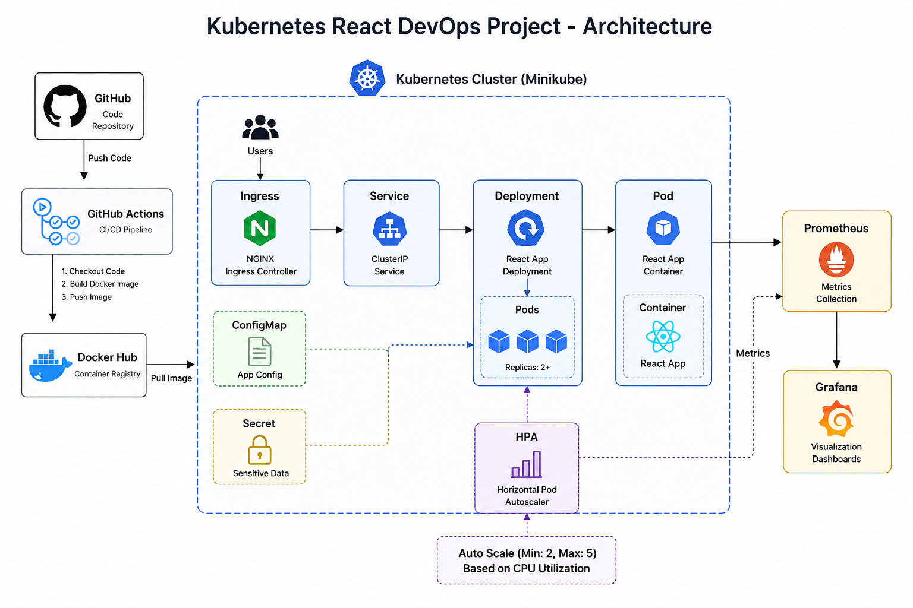

# Kubernetes React DevOps Project 🚀

## 📌 Overview
This project demonstrates an end-to-end DevOps workflow using a React application deployed on Kubernetes with CI/CD, monitoring, and autoscaling.

---

## 🏗️ Architecture

GitHub  
↓  
GitHub Actions (CI/CD)  
↓  
Docker Image  
↓  
Docker Hub  
↓  
Kubernetes Cluster (Minikube)  
↓  
Deployment → Pods → Service → Ingress  
↓  
Prometheus + Grafana (Monitoring)  
↓  
Horizontal Pod Autoscaler (HPA)

---

## 🛠️ Tech Stack

- Docker  
- Kubernetes (Minikube)  
- GitHub Actions (CI/CD)  
- React.js  
- Nginx (optional production build)  
- Prometheus  
- Grafana  
- Helm (optional)  
- Horizontal Pod Autoscaler (HPA)

---

## 📦 Features

### 🐳 Containerization
- React application containerized using Docker
- Docker Compose for local development

---

### ☸️ Kubernetes
- Deployments
- Services (NodePort)
- Ingress Controller
- ConfigMaps & Secrets
- Horizontal Pod Autoscaling (HPA)

---

### 🔁 CI/CD Pipeline
- GitHub Actions automation
- Docker image build and push to Docker Hub
- Image tagging using commit SHA

---

### 📊 Monitoring & Observability
- Prometheus metrics collection
- Grafana dashboards
- Node and pod monitoring

---

### 📈 Autoscaling
- CPU-based Horizontal Pod Autoscaler
- Auto scale up/down based on load

---

## 🚀 Setup Instructions

### 1. Clone Repository
git clone https://github.com/<your-username>/kubernetes-react-devops-project.git  
cd kubernetes-react-devops-project  

---

### 2. Build Docker Image
docker build -t react-app .  
docker run -p 3000:3000 react-app  

---

### 3. Deploy to Kubernetes
kubectl apply -f k8s/  

Check status:
kubectl get pods  
kubectl get svc  
kubectl get ingress  

---

### 4. Access Application
minikube service react-service  

OR  
http://react.local  

---

### 5. Enable Monitoring (Prometheus + Grafana)
helm install monitoring prometheus-community/kube-prometheus-stack  

kubectl port-forward svc/monitoring-grafana 3000:80  

Login:
- Username: admin  
- Password: prom-operator  

---

### 6. Enable Autoscaling (HPA)
kubectl autoscale deployment react-app --cpu-percent=50 --min=2 --max=5  

---

## 🔄 CI/CD Pipeline

- Build Docker image  
- Push to Docker Hub  
- Tag image with commit SHA  
- Triggered automatically via GitHub Actions  

---

## ⚠️ Common Issues Handled

### ❌ CrashLoopBackOff
Application crash or startup failure

### ❌ ImagePullBackOff
Wrong or missing Docker image

### ❌ OOMKilled
Memory limit exceeded

### ❌ Metrics issues
HPA showing `<unknown>` CPU usage

---

## 📈 Future Enhancements

- Blue-Green Deployment  
- Canary Deployment  
- Helm packaging  
- Terraform AWS EKS deployment  
- ArgoCD GitOps workflow  

---

## 👨‍💻 Author

Vamsi Krishna  
DevOps Engineer | Kubernetes | AWS | CI/CD | Automation
